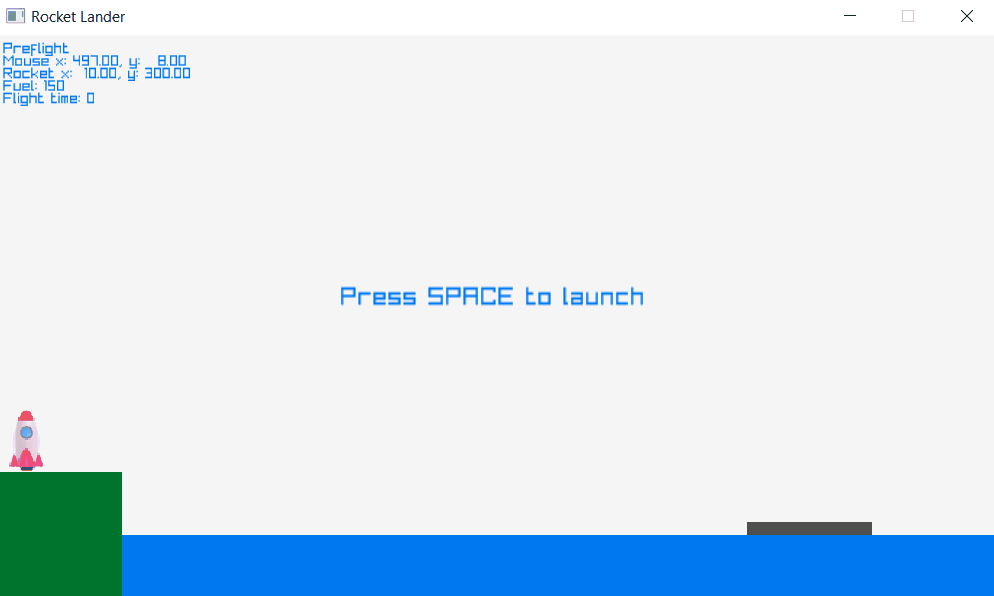
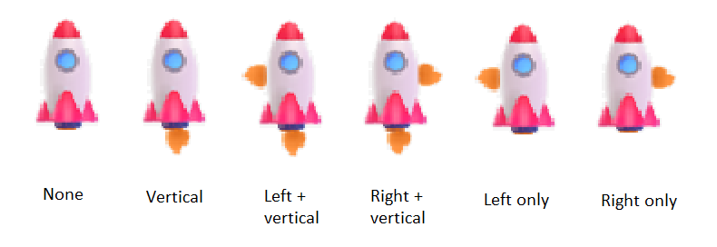
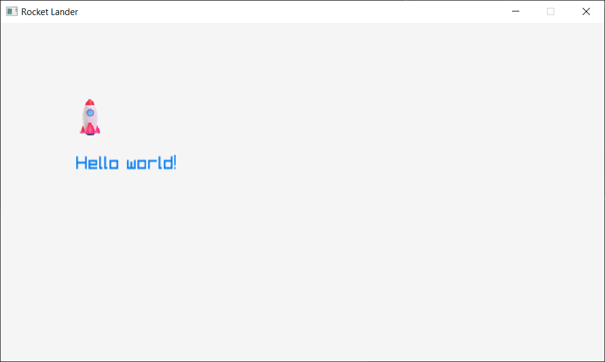

# Assignment - Rocket Lander

SpaceX has developed rocket boosters that can [takeoff](https://www.youtube.com/watch?v=1sJlFzUQVmY) and [land](https://www.youtube.com/watch?v=bvim4rsNHkQ) vertically. For this assignment you will create a rocket landing game that (very loosely) mimics this behavior.

## Description

Your rocket landing game will contain four different elements: land, water, a landing boat, and the rocket itself. The rocket will start on land at the launch pad. When triggered, it will take off and execute a preprogrammed manuever, then transfer control to the player. The player must guide the rocket back down to earth, landing on the boat in the water.

This assignment uses the [raylib](https://www.raylib.com/) library. This library provides simple abstractions for window management, user input, image loading, graphics rendering, font rendering, and more. For a list of functions the library provides, see the [cheatsheet](https://www.raylib.com/cheatsheet/cheatsheet.html).

## Requirements

### 1. Implementation

1.1. The program must be implemented using C++ and the [raylib](https://www.raylib.com/index.html) library.

### 2. Application window

2.1. The window dimensions may be fixed at 800 pixels wide by 450 pixels tall.

### 3. Game stages

The program must handle six different stages (states), each described below.

#### 3.1. Preflight

3.1.1. When the application first loads, the game must enter into the preflight stage.

3.1.2. The rocket must be placed stationary on the launchpad.

3.1.3. The rocket's remaining fuel must be reset to 150 units.

3.1.4. The program must display a message on screen telling the user to "Press SPACE to launch".

3.1.5. When the user presses the space bar, the program must enter into the launch stage.

#### 3.2. Launch

3.2.1. The rocket's main thruster must be activated, causing it to lift off the ground.

3.2.2. After the rocket achieves a predefined altitude (200 pixels from the bottom of the window), the program must enter into the roll stage.

#### 3.3. Roll

3.3.1. The rocket's main and left thrusters must be activated, causing it to continue upward and to the right.

3.3.2. After the rocket achieves a predefined altitude (400 pixels from the bottom of the window), the program must enter the manual control stage.

#### 3.4. Manual control

3.4.1. Automated thrust control must be terminated.

3.4.2. The player must be able to control the rocket's left, right, and main thrusters using the left, right, and up arrow keys.

- The left arrow applies the right thruster (moves rocket towards the left).
- The right arrow applies the left thruster (moves rocket towards the right).
- The up arrow applies the main thruster (moves rocket upward).

Manual control is the only stage where the user can control the rocket's thrusters.

<!-- prettierignore -->

3.4.3. The program must enter the success stage if the rocket lands on top of the boat.

<!-- prettierignore -->

3.4.4. The program must enter the failure stage if any of the following conditions are met:

- The rocket collides with any surface other than the top of the landing boat.
- The rocket goes outside the left or right edge of the window.

#### 3.5. Success

3.5.1. The rocket's acceleration and velocity must be set to 0.

3.5.2. The program must display a success message on the screen.

3.5.3. If the user presses the space bar, the program must reset the simulation and enter the preflight stage.

#### 3.6. Failure

3.6.1. The same requirements as the success stage, except the program must show a failure message instead of success.

### 4. Graphics

4.1. The program must draw the rocket in the correct position on screen using a 2D texture.

- A rocket texture image has been provided in `game/rocket.png` that can be used.

<!-- prettier-ignore -->
4.2. The program must display an indication of which thrusters on the rocket are active at any given time.

- A flame texture image has been provided in `game/flame.png` that can be used.
- The image below shows example drawings of the rocket and flame depending on which thrusters are active.

4.3. The program must draw a representation of the land, water, and landing boat in their correct positions and dimensions. You can use simple, colored rectangles to represent these items, using green for land, blue for water, and dark gray for the boat.

4.4. The program must display the following statistics in the upper left corner of the window:

- The current stage of the rocket's flight: preflight, launch, roll, or manual control.
- The current x/y coordinates of the rocket.
- The amount of fuel remaining.

### 5. Simulation

5.1. The program must implement a basic physics model based on Newton's first law of motion.

Practically speaking, this means you need to track the rocket's velocity and acceleration in two dimensions (x and y). Each of the rocket's thrusters result in a constant acceleration applied to the rocket in the corresponding direction:

- The left thruster applies an acceleration to the right.
- The right thruster applies an acceleration to the left.
- The main thruster applies an acceleration upward.

<!-- prettier-ignore -->
5.2. The rocket must be subjected to gravity (a constant acceleration downward) at all times. Thus, in order to get off the ground, the rocket must have a higher acceleration in the opposite direction.

5.3. Each of the rocket's three thrusters must use 10 units of fuel per second.

5.4. The rocket must have available fuel in order to activate the thrusters. If the available fuel hits 0, the thrusters cannot fire.

5.5. Collisions with the ground, water, and boat must be detected. You can use simple bounding boxes (i.e., using `CheckCollisionRecs`) to perform collision detection. Collisions must result in the rocket stopping immediately (the rocket should not clip through those obstacles). Refer to the stage requirements for what action to take when a collision is detected with certain objects.

## Getting started

1. Clone your assignment repository to your computer.

1. Open and build the provided code.

   - NOTE: when you first configure CMake for this project, it may take a bit longer than normal. The CMake project is configured to automatically download the raylib library for you. Be patient and monitor the output window of whatever editor you are using.

1. Run the program. You should see a window with the text "Hello world" displayed and a small rocket ship drawn on the screen. It should look like the screenshot below:

You are now ready to proceed with the assignment.

## Dimensions

Below is a drawing of the suggested dimensions of the window and various components.

Note: the default window coordinate system places `(0, 0)` in the upper left corner of the window with the positive Y axis going downward. You'll have to keep this in mind when dealing with object positions, velocities, and accelerations.

## Credits

This assignment is inspired by the [Rocket Landing Simulator](http://nifty.stanford.edu/2021/de-freitas-weingart-rocket-simulator/) assignment by Adrian A. de Freitas and Troy Weingart.
