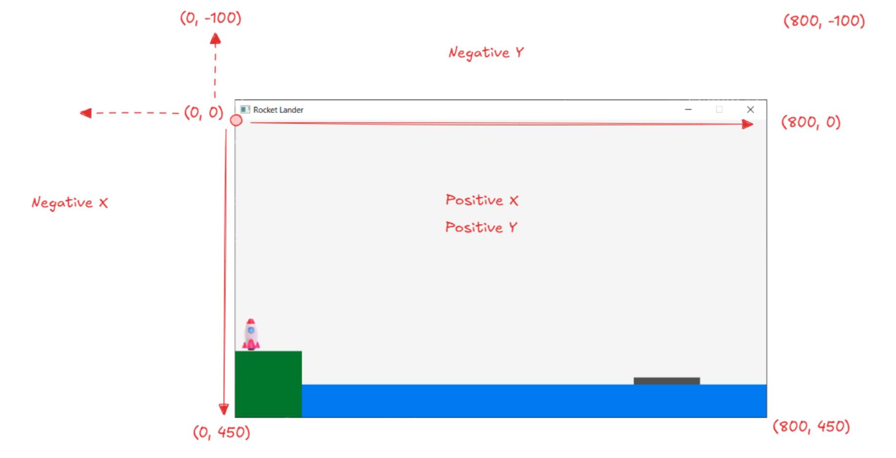
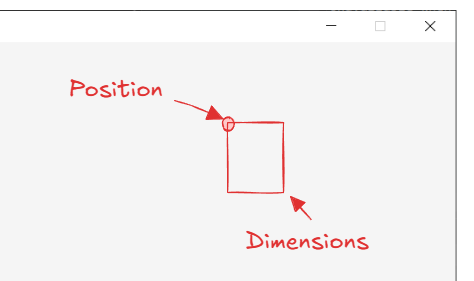
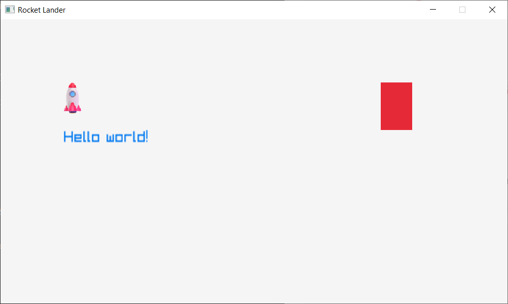
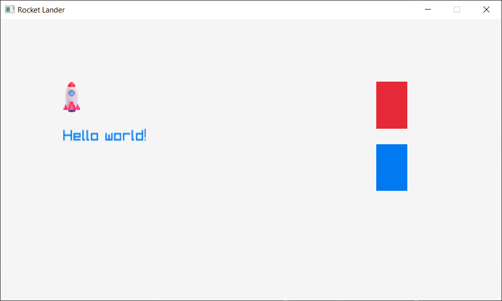
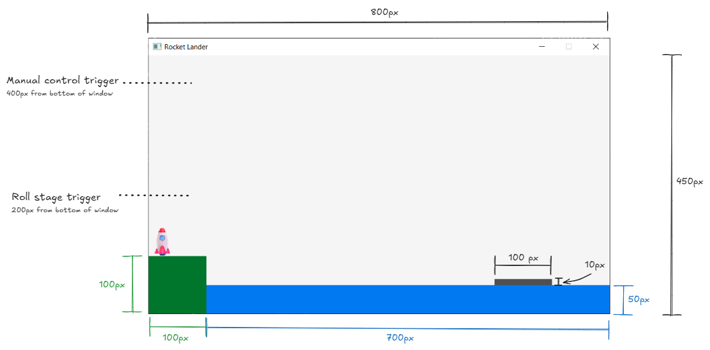
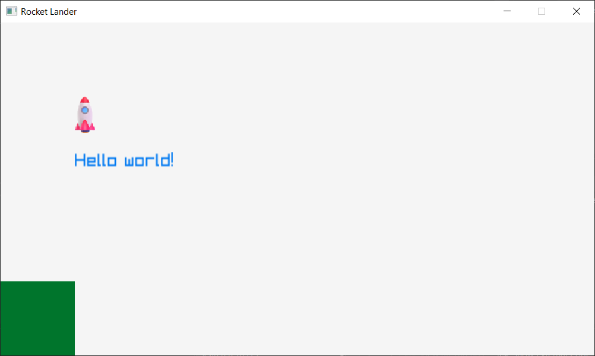
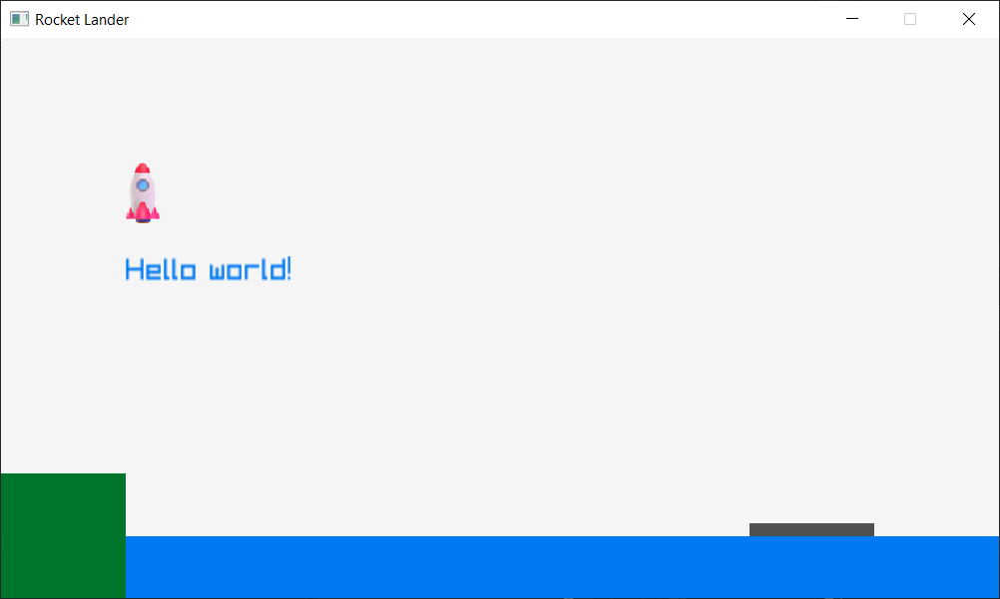

# Phase 1

This phase of the assignment focuses on familiarizing yourself with the project and drawing the environment (ground, water, and landing boat).

## Architecture

The starter code provides comments, a number of empty functions, basic window initialization, and a main game loop. Through this assignment you will flesh out the details and add additional code to implement the assignment.

The project uses the [raylib](https://www.raylib.com/) library. This library provides a lot of abstractions for us, simplifying many tasks such as:

- window creation and management
- user input handling
- graphics rendering
- image loading
- font rendering
- etc.

The game is set up with a main loop that will run until the library is told its time to quit.

```
while (!WindowShouldClose()) {
    // Main loop body
}
```

Every iteration of the loop we will generate a new frame to display in the game's window. There are two parts to this process:

- Update phase: run any logic, simulation, physics, etc. necessary for our game.
- Draw phase: render the current state of the world and present it on screen.

## Window coordinates

We are using the default window coordinate system, where the origin (0, 0) is at the upper left corner of the window. The and X axis grows to the right and the Y axis grows towards the bottom. Our window has fixed dimensions for simplicity.



The objects in the assignment are simple rectangles. When you go to place an object, there are two properties to consider:

- Position/origin: the (X, Y) location of the upper-left corner of the item.
- Dimensions: the width and height of the item.



## Drawing a rectangle

We can use the raylib library to draw a simple rectangle. We'll demonstrate two ways of drawing rectangles.

### Using `DrawRectangle`

The `DrawRectangle` is a function provided by raylib. It takes five parameters: `x`, `y`, `width`, `height`, and `color`. The `color` parameter can be one of the predefined colors provided by raylib or a custom color. Some of the predefined colors include `RED`, `BLUE`, `GREEN`, `DARKGREEN`, `GRAY`, and `DARKGRAY`.

Find the `DrawEnvironment` function in `main.cpp`. Update the function to look like this:

```
void DrawEnvironment()
{
    DrawRectangle(600, 100, 50, 75, RED);
}
```

If you run the game now, you should see this output:



### Using `DrawRectangleRec`

There is an alternate version of the `DrawRectangle` function called `DrawRectangleRec`. This function takes a `Rectangle` struct instead of four separate parameters for the position and dimensions of the rectangle.

Find the `DrawEnvironment` function in `main.cpp`. Update the function to look like this:

```
void DrawEnvironment()
{
    DrawRectangle(600, 100, 50, 75, RED);

    Rectangle r;
    r.x = 600;
    r.y = 200;
    r.width = 50;
    r.height = 75;
    DrawRectangleRec(r, BLUE);
}
```

If you run the game now, you should see this output:



There is also a shortcut for initializing structs, where you list the member values in order:

```
Rectangle r = { 600, 200, 50, 75 };
```

In this case, the order of the member variables within the struct is `x`, `y`, `width`, `height`.

## Drawing the environment

Let's draw the environment objects in our world using our knowledge of drawing rectangles. Review the suggested dimensions of the world:



We'll start by drawing the ground in the lower-left portion of the window. To make things easier, we'll define some constants to store the position and dimensions of the rectangle.

Find the section of code in `main.cpp` for terrain variables and update it as shown below:

```
/* ----------------------------------------------------------------------------
Terrain variables
----------------------------------------------------------------------------- */

const float GROUND_HEIGHT = 100;
const float GROUND_WIDTH = 100;
const float GROUND_X = 0;
const float GROUND_Y = FROM_BOTTOM(GROUND_HEIGHT);

Rectangle g_ground = { GROUND_X, GROUND_Y, GROUND_WIDTH, GROUND_HEIGHT };
```

This code defines four constants for the bounds of our ground rectangle. Using these constants, we construct the `g_ground` variable using a `Rectangle` structure.

Notice the `FROM_BOTTOM` macro. This has been provided to help compute a Y coordinate from the bottom of the game window.

The final step is to actually draw our ground rectangle.

Find the `DrawEnvironment` function in `main.cpp`. Update the function to look like this:

```
void DrawEnvironment()
{
    DrawRectangleRec(g_ground, DARKGREEN);
}
```

If you run the game now, you should see this output:



## Finishing phase 1

Complete phase 1 by writing additional code to draw the water and the landing boat. When you are finished, your game should look similar to this:


