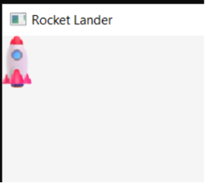
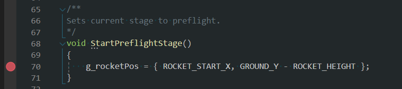
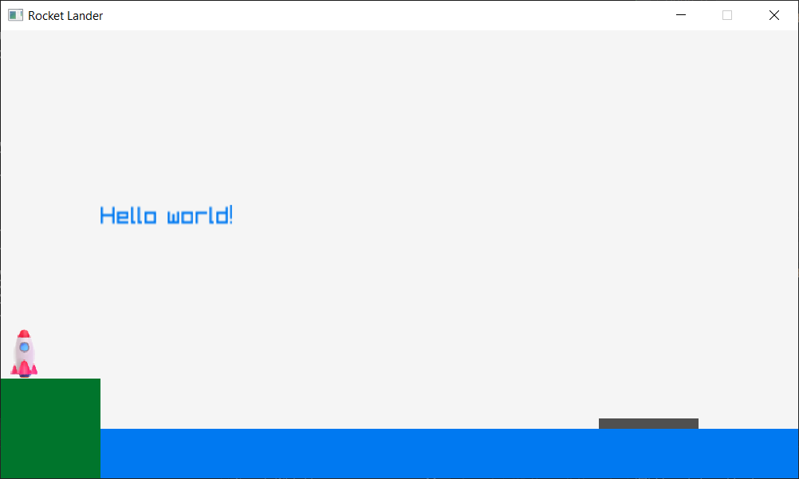
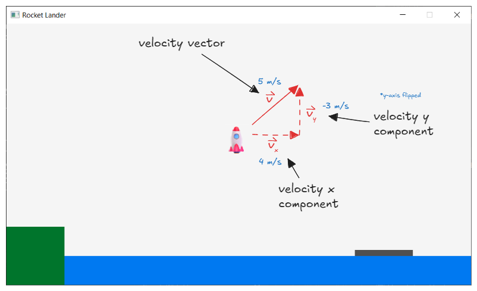
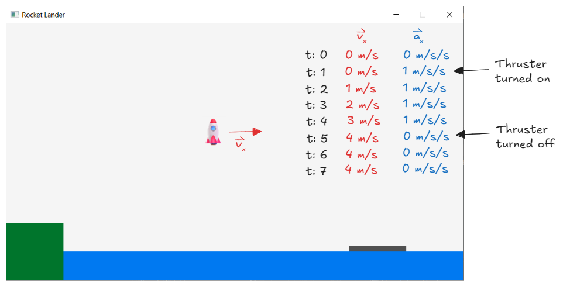

# Phase 2

## Rocket position

We'll start by positioning the rocket on the launchpad.

Find the section at the top of `main.cpp` for rocket variables and add a position variable for the rocket.

```
Vector2 g_rocketPos = { 0, 0 };
```

Next, find the `DrawRocket` function. Update that function to look like this:

```
void DrawRocket()
{
    DrawTexture(g_rocketTexture, g_rocketPos.x, g_rocketPos.y, WHITE);
}
```

Notice that we are using the `DrawTexture` function from the raylib library. This draws an image on screen at the specified X and Y coordinate. The texture file is loaded during program initialization and stored in the `g_rocketTexture` variable.

If you run the game at this point, the rocket should be placed in the upper-left corner of the screen. This is position `(0, 0)`.



Let's move it to the correct position on the launchpad. First, add some constants:

```
const float ROCKET_START_X = 10;
const float ROCKET_WIDTH = 27;  // Width of the rocket texture
const float ROCKET_HEIGHT = 50; // Height of the rocket texture
```

Our rocket lander game is going to have multiple stages. A number of empty `StartXXXStage()` functions have been provided for you. We can use these functions to initialize any variables at the beginning of each stage.

Find the `StartPreflightStage()` function and update it to look like this:

```
void StartPreflightStage()
{
    g_rocketPos = { ROCKET_START_X, GROUND_Y - ROCKET_HEIGHT };
}
```

This will position the rocket on the correct spot on the launchpad. If you run the game right now, you'll notice that the rocket didn't move! Why not?

Set a breakpoint on the line within the `StartPreflightStage()` function:



If you run the game, you'll notice that this breakpoint is never hit, meaning this code is never called, thus the rocket never gets set to the correct starting location.

We can call the `StartPreflightStage()` during the initialization phase of our program. Find the code within the `main()` function that loads the rocket texture, and add a call to `StartPreflightStage()` right after it.

```
// Load rocket texture
// ... (rocket texture loading code here)

// App must enter preflight stage upon startup
StartPreflightStage();
```

Now the rocket should be in the correct starting position:



## Physics

The next part of the game we will tackle is getting the rocket to move around the screen. We are going to use a very simple physics model based on Newton's laws of motion, specifically:

- An object at rest stays at rest. An object in motion stays in motion. (Unless acted upon by some force).
- For every action, there is an equal and opposite reaction.

We'll boil these laws down into two concepts: velocity and acceleration.

### Velocity

Velocity tells us the current speed of the rocket and in which direction the rocket is traveling.



Velocity is a vector: it has both direction (where the rocket is heading) and magnitude (how fast its going in that direction). Velocity is measured as some unit of distance per some unit of time. A common measurement is meters per second (`m/s`). In other words, how many meters does the object travel every second.

We can break down the velocity vector into two components: X and Y.

- X velocity is how fast the rocket is traveling along the X axis.
- Y velocity is how fast the rocket is traveling along the Y axis.
- The sign of the velocity (positive or negative) indicates the direction along that axis the rocket is traveling.

Let's write some code to demonstrate velocity. Add a new variable to store the rocket's velocity. Since we are dealing with a 2D world, we only need an X and Y component, so a `Vector2` structure is perfect.

```
Vector2 g_rocketVel = { 0, 0 };
```

For every frame of our game, we need to check the rocket's velocity and update the rocket's position based on how fast it is moving. The first step is to determine how much time has passed since the last frame.

Find the "update frame" portion of the main game loop and add a call to `GetFrameTime()`:

```
/* ------------------------------------------------------------------------
Update frame

Run any logic to compute the state of this frame, such
as user input, game state, and physics computations.
------------------------------------------------------------------------- */

// Determine how many seconds have passed since the last frame
float deltaTimeSec = GetFrameTime();
```

After that, we can update the rocket's position based on it's velocity:

```
// Update rocket position based on velocity
g_rocketPos.x += (g_rocketVel.x * deltaTimeSec);
g_rocketPos.y += (g_rocketVel.y * deltaTimeSec);
```

To test this, add some temporary code (above the code that sets the rocket position) and hardcode a velocity value:

```
// TEMP : Set test velocity
g_rocketVel.x = 10;
g_rocketVel.y = 0;
```

If you run the game now, the rocket should slowly move toward the right side of the screen. You can play with different velocity values (positive and negative) and observe the results.

### Acceleration

We don't want to control the rocket's velocity directly. Instead, we want to control the rocket's acceleration.

Acceleration is also a vector, but it tells us how fast the velocity is changing over time (and in which direction). The longer you apply acceleration, the faster you will go in that direction. Think about driving a car - the longer you keep the acceleration pressed down, the faster you go.

For our rocket, the thrusters (rocket engines) will dictate the acceleration forces. Our rocket will have three thrusters: one pointing left, one pointing right, and one pointing down.

The following diagram demonstrates the affect of acceleration on velocity. It shows just the X component for simplicity.



- The left column shows time in seconds (i.e., `t: 2` indicates two seconds have passed).
- The middle column shows the velocity on the X axis.
- The right column shows the acceleration on the X axis.

At `t: 1`, the left-facing thruster was activated, which triggered a positive acceleration on the X axis. In other words, the thruster caused the rocket to start moving toward the right side of the screen.

For each second that passed, the rocket's acceleration increased by `1 m/s`. When the thruster was shut off at `t: 5`, the acceleration was removed (set to `0`). The velocity remained constant as the rocket kept moving toward the right side of the screen.

Let's take this concept of acceleration and apply it to our code. We'll add another variable to store the rocket's acceleration:

```
Vector2 g_rocketAcc = { 0, 0 };
```

Remove the temporary hard-coded acceleration we set previously. Replace it with the following code to update the rocket's velocity based on it's acceleration:

```
// Apply acceleration forces to rocket
g_rocketVel.x += (g_rocketAcc.x * deltaTimeSec);
g_rocketVel.y += (g_rocketAcc.y * deltaTimeSec);
```

We need to test our rocket physics again, so let's add some new temporary code right above our acceleration computations:

```
if (IsKeyDown(KEY_RIGHT))
    g_rocketAcc.x = 30;
else if (IsKeyDown(KEY_LEFT))
    g_rocketAcc.x = -30;
else
    g_rocketAcc.x = 0;
```

The `IsKeyDown()` function is provided by raylib and let's us check if certain keys are being held down. This code will use the arrow keys (left/right) to apply a constant acceleration to the rocket. Notice that if neither key is pressed, we clear the acceleration on the X axis.

You should be able to run the program now and move the rocket left and right using the arrow keys.

### Gravity

The rocket thrusters aren't the only acceleration we have to deal with. We also need to apply gravity to our rocket. Gravity is a constant acceleration applied downward on the Y axis.

We can define a constant to store our gravity acceleration.

```
const float GRAVITY_ACC_Y = 9.8f;
```

Notes:

- I chose `9.8` as the value for gravity here. This isn't strictly required though; we're not making a physically accurate simulator.
- The gravity acceleration here is positive since our Y axis is flipped.

We can update our acceleration computations to apply gravity:

```
// Apply acceleration forces to rocket
g_rocketVel.x += (g_rocketAcc.x * deltaTimeSec);
g_rocketVel.y += (g_rocketAcc.y * deltaTimeSec);
g_rocketVel.y += (GRAVITY_ACC_Y * deltaTimeSec);
```

If you run the game now, you should see the rocket sink slowly downward into the ground.

Let's update our temporary control code to add control for the main rocket engine:

```
if (IsKeyDown(KEY_UP))
    g_rocketAcc.y = -30;
else
    g_rocketAcc.y = 0;
```

If you run the game now, gravity should pull the rocket down, but if you hold the up arrow key, the rocket will slowly begin to lift off and travel upward. If you release the up arrow, gravity will slowly begin to pull the rocket back down to Earth.
