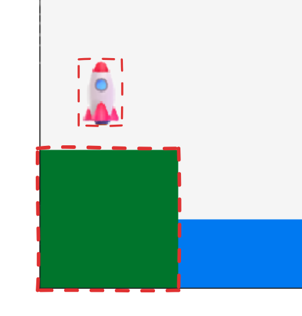
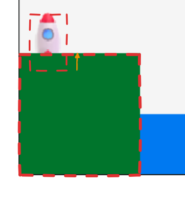
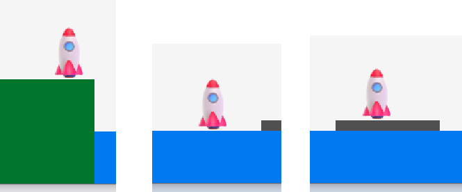
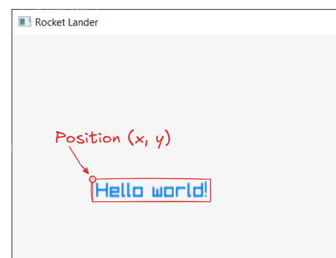
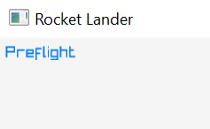
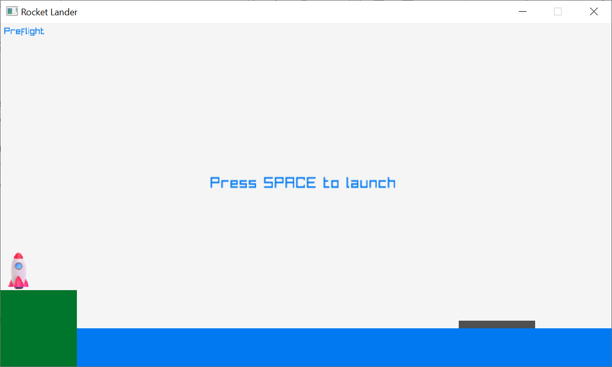

# Phase 3

## Collision detection

At this point we have simulated velocity and acceleration of the rocket. Now we need to detect when the rocket collides with any other objects in the world. This is called *collision detection*.

We'll use a very simple method for detecting collisions using bounding boxes.



Our rocket looks like a complex shape, but you can pretend there is a rectangle that neatly fits around the outside of the rocket. This is called a bounding box - a rectangle that surrounds the object being referred to. This acts like the outer boundary line of the object.

The bounding box of the rocket needs to be computed every frame since the rocket can move around. The upper-left corner of the bounding box is set to the current position of the rocket.

Add a line in the main game loop to compute the rocket's bounding box. Do this right after updating the rocket's position:

```
// Update rocket position based on velocity
// ...

// Collision detection
Rectangle rocketBounds = { g_rocketPos.x, g_rocketPos.y, ROCKET_WIDTH, ROCKET_HEIGHT };
```

The ground, water, and landing boat already have rectangles defined. We can use the existing variables as their bounding boxes.

We need to detect whether the rectangles intersect. If the rocket bounding box intersects with any other object in the world, we know a collision has happened.

The math for detecting a collision between two rectangles is pretty simple, but even simpler is using the `CheckCollisionRecs` function provided by raylib.

### Collision with the ground

Add the following code to check collision with the ground:

```
// Check collision with ground
if (CheckCollisionRecs(rocketBounds, g_ground)) {
    // TODO
}
```

We can detect a collision with the ground - now what?



There are two actions we need to take:

1. Kill the rocket's velocity (make it stop moving).
2. Reset the position of the rocket so it sits on top the ground.

Remember a certain amount of time passes with each frame we compute. We won’t necessarily detect a collision right at the point of impact. The projected trajectory may place the rocket within the target object. We need to move the rocket back into the correct position.

Update the collision detection code to make make these two adjustments:

```
// Check collision with land
if (CheckCollisionRecs(rocketBounds, g_ground)) {
    g_rocketVel = { 0, 0 };
    g_rocketPos = { g_rocketPos.x, g_ground.y - ROCKET_HEIGHT };
}
```

Run the game now. The rocket should be resting on the launch pad and not sinking into the ground. Use the arrow keys to take off, then land back down off the ground. The rocket should stop and rest on top the ground.

### Collision with water and boat

Add collision detection for the water and landing boat. You can use the same pattern we used for the ground.

When you are finished you should be able to land the rocket on the ground, water, and landing boat. You don't have to do any special collision with the water; you can treat it as a solid object.



## Game stages

The core mechanics of the game are working now. It’s time to start setting up the game stages:

- Preflight - rocket is on the launchpad ready to lift off.
- Launch - rocket launch has been triggered and the rocket begins to lift off the ground.
- Roll - rocket has cleared the launch tower and begins to move up and to the right.
- Manual control - rocket is in manual control mode and is controlled by the player.
- Success - rocket has landed on the landing boat.
- Failure - rocket has crashed or went out of bounds.

Start by adding an enumeration that lists the available stages. You can add this near the top of `main.cpp` in the "Gameplay state" section.

```
/* ------------------
Gameplay state
-------------------*/

enum Stage
{
    STAGE_PREFLIGHT,
    STAGE_LAUNCH,
    STAGE_ROLL,
    STAGE_MANUAL,
    STAGE_SUCCESS,
    STAGE_FAILURE,
};
```

Add a variable right below to track the current stage.

```
Stage g_currentStage;
```

When a new stage is started, the `g_currentStage` variable needs to be set to the correct value.

The starter code for the assignment contains a `StartXXXStage()` function for each stage. Update each of these functions and assign the current stage variable accordingly.

For example:

```
void StartPreflightStage()
{
    g_currentStage = STAGE_PREFLIGHT;
    // ...
}
```

## Text rendering

Before we implement the behavior of each stage, we'll add some text on the screen to tell the player what stage is currently active. Raylib provides text rendering functions that we can use, such as `DrawText()`.

The X/Y position of the text is the upper-left corner where the text starts:



### Current stage

Two functions have been provided for you to start with. Find the `DrawHud` function in `main.cpp`. Add a call to the `DrawCurrentStageText` function:

```
void DrawHud()
{
    DrawCurrentStageText();
    // ...
}
```

You can add the text drawing code to the `DrawCurrentStageText` function. Find that function in `main.cpp`.

First let's demonstrate the text drawing function in action:

```
void DrawCurrentStageText()
{
    DrawText("Preflight", 5, 5, 12, BLUE);
}
```

If you run the game you should see the text "Preflight" appear in the upper-left corner.



Of course we need to conditionally render the correct text based on which stage is active. Update the `DrawCurrentStageText()` function to display the correct text based on `g_currentStage`.

### Preflight instructions

We want to show the user a message telling them to press space to launch the rocket.

Update the `DrawHud()` function to look do this:

```
void DrawHud()
{
    DrawCurrentStageText();

    if (g_currentStage == STAGE_PREFLIGHT)
        DrawText("Press SPACE to launch", 275, 200, 20, BLUE);
}
```

When you run the game, you should now see the current stage in the upper-left corner and the preflight instructions in the center of the screen.



## Preflight stage

We can now begin to implement each stage of the game. Each stage has two associated functions:

- `StartXXXStage()` - runs once when a stage is started to set up any initial conditions.
- `RunXXXStageFrame()` - runs every frame when that stage is active.

We'll start implementing the preflight stage. The startup conditions for the preflight stage are pretty simple:

- Reset the rocket's position to the launch pad (we already did this in a previous phase).
- Clear the rocket's velocity.
- Clear the rocket's acceleration.

Find the `StartPreflightStage()` function in `main.cpp` and update it as shown below:

```
void StartPreflightStage()
{
    g_currentStage = STAGE_PREFLIGHT;
    g_rocketPos = { ROCKET_START_X, GROUND_Y - ROCKET_HEIGHT };
    g_rocketAcc = { 0, 0 };
    g_rocketVel = { 0, 0 };
}
```

For each frame during preflight, the only to do is check if the user pressed the spacebar to trigger the launch.

Find the `RunPreflightStageFrame()` in `main.cpp` and update it as shown below:

```
void RunPreflightStageFrame()
{
    // Wait until space bar pressed to trigger launch
    if (IsKeyPressed(KEY_SPACE))
        StartLaunchStage();
}
```

The last step is to make sure the `RunPreflightStageFrame()` function gets called in the main game loop. Do this right after getting the frame time.

```
// Determine how many seconds have passed since the last frame
// ...

// Run stage-specific logic
switch (g_currentStage) {
case STAGE_PREFLIGHT:
    RunPreflightStageFrame();
    break;
}
```

If you run the game now, the game should start in the preflight stage. If you press the spacebar, the current stage should switch to the launch stage. The preflight instruction message should disappear.

The launch stage doesn't do anything yet; we'll take care of that in the next phase of the assignment.
