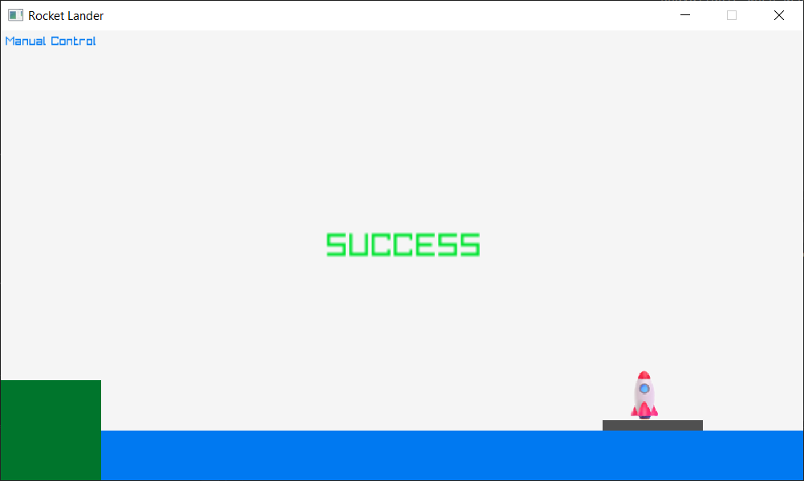
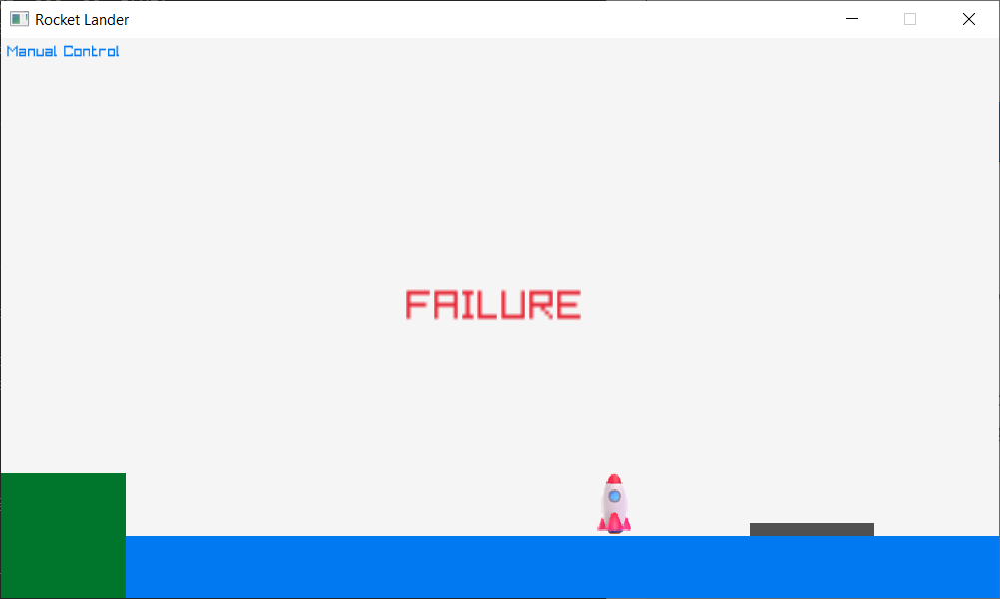

# Phase 4

This phase will focus on implementing the remaining stages of the game.

## Launch stage

The launch stage will automatically engage the vertical thruster of the rocket causing it to lift off the launch pad straight up into the air. The launch stage will execute until the rocket has hit a predetermined number of pixels from the bottom of the screen. Once this trigger point is reached, the game will activate the roll stage.

Comment out the test code we added previously for controlling acceleration with the arrow keys. We'll come back to this later when we implement the manual control stage. The launch stage is an autopilot controlled stage.

Let's establish some constants for the launch stage. Listing these constants in one place will let us tweak them easier later on.

```
const float LAUNCH_ACC_X = 0;
const float LAUNCH_ACC_Y = -15.0f;
const float ROLL_STAGE_TRIGGER_Y = FROM_BOTTOM(200.0f);  // The Y coord of the rocket that triggers the roll stage
```

- We don't want the rocket moving side-to-side, so the X velocity is 0.
- We want the rocket to lift upward, so we use a negative acceleration (due to our flipped Y axis).
- We need a trigger point to know when to transition to the roll stage. We use a set number of pixels from the bottom of the game window for this.

Remember there are two functions to implement for each stage: a start function and a run function. Startup for the launch stage is simple: apply the correct acceleration to the rocket.

```
void StartLaunchStage()
{
    g_currentStage = STAGE_LAUNCH;
    g_rocketAcc = { LAUNCH_ACC_X, LAUNCH_ACC_Y };
}
```

If you run the game now, the rocket should lift straight up in the air when you press the space bar.

Next, implement the frame logic for the launch stage. We need to check if the rocket has reached the trigger altitude for the roll stage. If it has, start the roll stage.

```
void RunLaunchStageFrame(float deltaTimeSec)
{
    if (g_rocketPos.y < ROLL_STAGE_TRIGGER_Y) {
        StartRollStage();
    }
}
```

Don't forget to add a call to the `RunLaunchStageFrame()` function in the main loop.

```
switch (g_currentStage) {
case STAGE_PREFLIGHT:
    RunPreflightStageFrame();
    break;
case STAGE_LAUNCH:
    RunLaunchStageFrame(deltaTimeSec);
    break;
}
```

If you run the program now, the behavior will be the same, but the current stage text indicator should change to the roll stage when the correct altitude is reached.

The preflight and launch stages are now complete!

## Roll stage

The roll stage is still part of the autopilot portion of the flight, but it will cause the rocket to start moving right as well as up.

Implement the roll stage. You can follow a similar pattern we used for the launch stage. Here are some constants to help you:

```
const float ROLL_ACC_X = 5.0f;
const float ROLL_ACC_Y = -15.0f;

// The Y coord of the rocket that triggers the manual control stage
const float MANUAL_STAGE_TRIGGER_Y = FROM_BOTTOM(400.0f);
```

Tips:

- For `StartRollStage()`: apply the correct acceleration to the rocket for the roll stage.
- For `RunRollStageFrame()`: if the rocket's Y position has reached the manual stage trigger, start the manual stage.
- Don't forget to add a call to `RunRollStageFrame()` in the main loop.

If you run the game now, you should be able to launch, roll, and reach the manual control stage. We haven't hooked up manual control yet, so the rocket will keep going up and to the right indefinitely.

## Manual control stage

When the manual control stage starts, the autopilot shuts off (rocket acceleration is cleared) and the player is now in control.

```
void StartManualStage()
{
    g_currentStage = STAGE_MANUAL;
    g_rocketAcc = { 0, 0 };
}
```

Add some constants to use for manual control acceleration. These will be used when the player activates the rocket's thrusters.

```
const float MANUAL_CONTROL_ACC_X = 10.0f;
const float MANUAL_CONTROL_ACC_Y = -15.0f;
```

For every frame, check for player input. We already did this with our test code we commented out earlier. Move the input control code into the `RunManualStageFrame()` function and update it to use the constants defined above.

```
void RunManualStageFrame(float deltaTimeSec)
{
    // Apply left or right thrust depending on what key user has pressed
    if (IsKeyDown(KEY_RIGHT))
        g_rocketAcc.x = MANUAL_CONTROL_ACC_X;
    else if (IsKeyDown(KEY_LEFT))
        g_rocketAcc.x = -MANUAL_CONTROL_ACC_X;
    else
        g_rocketAcc.x = 0;

    // Apply vertical thrust if user is pressing up arrow
    if (IsKeyDown(KEY_UP))
        g_rocketAcc.y = MANUAL_CONTROL_ACC_Y;
    else
        g_rocketAcc.y = 0;
}
```

Make sure to call the manual control logic each frame.

```
switch (g_currentStage) {
// ... other cases omitted for brevity
case STAGE_MANUAL:
    RunManualStageFrame(deltaTimeSec);
    break;
}
```

At this point the game should be roughly playable from launch until landing.

However, it’s painfully slow. This is where we can start tweaking the game for fun. There are various ways to do this. One option is to add a velocity scale value for the rocket:

```
const float VELOCITY_SCALE = 5;

// ...

// Update rocket position based on velocity
g_rocketPos.x += (g_rocketVel.x * deltaTimeSec) * VELOCITY_SCALE;
g_rocketPos.y += (g_rocketVel.y * deltaTimeSec) * VELOCITY_SCALE;
```

Of course you can tweak the behavior of the game and rocket to your liking.

## Success stage

If the rocket lands on the boat, the success stage needs to be triggered. Head back to the collision detection code. Add a call to trigger the success stage.

```
// Check collision with landing boat
if (CheckCollisionRecs(rocketBounds, g_boat)) {
    // ...
    StartSuccessStage();
}
```

The startup for the success stage should kill the rocket acceleration.

```
void StartSuccessStage()
{
    g_currentStage = STAGE_SUCCESS;
    g_rocketAcc = { 0, 0 };
}
```

Finally, update the `DrawHud()` function to draw a success message.

```
if (g_currentStage == STAGE_PREFLIGHT)
    DrawText("Press SPACE to launch", 275, 200, 20, BLUE);
else if (g_currentStage == STAGE_SUCCESS)
    DrawText("SUCCESS", 325, 200, 32, GREEN);
```

If you run the game now, you should see a success message when you land on the boat.



## Failure stage

If the rocket lands on the water or the ground, the failure stage needs to be triggered.

Implement the failure stage. This will be similar to the success stage.

There is one slight difference when checking for collision with the ground. If the rocket is in the preflight stage, we don't want to trigger failure. Only trigger a failure during the manual control stage.

```
// Check collision with land
if (CheckCollisionRecs(rocketBounds, g_ground)) {
    // ...

    if (g_currentStage != STAGE_PREFLIGHT) {
        StartFailureStage();
    }
}
```

When you are finished with the failure stage, you should see a failure message when landing on the ground or water.


