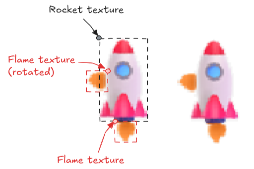

# Phase 5

## Restart game

When the game ends (either success or failure), we want the player to be able to restart the game by pressing the space bar.

There is a `RunEndGameStage()` function that can be used for both the success and failure stages. The function should start the preflight stage if the space bar has been pressed.

```
void RunEndGameStage()
{
    if (IsKeyPressed(KEY_SPACE)) {
        StartPreflightStage();
    }
}
```

Add a call to this function in the main loop.

```
switch (g_currentStage) {
// ... other cases omitted for brevity
case STAGE_SUCCESS:
case STAGE_FAILURE:
    RunEndGameStage();
    break;
}
```

The player can now restart the game after the succeed or fail.

## Draw flames

Let's give some visual indication when the rocket is firing its thrusters. We'll draw a flame texture indicating which thrusters are firing at any given time.

A flame texture is provided. It can be drawn multiple times in different places. It can be rotated and used for the side thrusters (that way a separate image isn't needed).



Start by defining a texture object for the flame texture.

```
Texture2D g_rocketTexture; // existing rocket texture
Texture2D g_flameTexture;
```

Find where the existing rocket texture is being loaded and do the same for the flame texture.

```
// Load flame texture
g_flameTexture = LoadTexture("flame.png");
if (!g_flameTexture.id)
    throw new runtime_error("Failed to load flame texture.");
```

Update the `DrawRocket()` function to draw the flame coming out the bottom of the rocket.

```
void DrawRocket()
{
    DrawTexture(g_rocketTexture, g_rocketPos.x, g_rocketPos.y, WHITE);

    if (g_rocketAcc.y < 0)
        DrawTexture(g_flameTexture, g_rocketPos.x - (g_flameTexture.width / 2) + (ROCKET_WIDTH / 2), g_rocketPos.y + ROCKET_HEIGHT, WHITE);
}
```

- This positions the flame texture so it is centered at the bottom of the rocket.

For the horizontal engines, we have to use a different function from raylib that allows us to rotate the texture. Here's an example for the left thruster:

```
if (g_rocketAcc.x > 0)
    DrawTextureEx(g_flameTexture, { g_rocketPos.x + 2, g_rocketPos.y + (ROCKET_HEIGHT / 2) - 5 }, 90, 1, WHITE);
```

Implement the right thruster next. Follow the pattern used above for the left thruster. You will have to use a different rotation angle and coordinates.

These don't have to be exact; you can place them where you want, but find something that looks good for the game.

When you are done, you should see all three thrusters in the game in the correct position. The flames should only be visible when that particular rocket engine is firing.

## Fuel limit

To make the game more challenging, simulate a fuel tank on the rocket. The rocket has a limited amount of fuel to burn. If the rocket runs out of fuel, the engines cannot fire.

Add some fuel constants and a variable to track the current fuel level.

```
const float ROCKET_FUEL_PER_SEC = 10;
const float ROCKET_STARTING_FUEL = 150;
// ...
float g_rocketFuel;
```

During preflight startup, reset the rocket's fuel level.

```
g_rocketFuel = ROCKET_STARTING_FUEL;
```

Display the amount of fuel remaining on the HUD (in the `DrawHud()` function):

```
stringstream fuelStr;
fuelStr << "Fuel: " << g_rocketFuel;
DrawText(fuelStr.str().c_str(), 5, 35, 12, BLUE);
```

- This uses a `stringstream` to build a string (requires `#include <sstream>`). It's similar to `cout` but instead of writing to the standard output, it writes directly to a string variable in memory.

Implement the fuel simulation in the game. Here are some tips:

- This can be done in the main loop, right before applying the acceleration to the rocket.
- If there is no rocket fuel, kill the rocket acceleration.
- Calculate how much fuel is being used and subtract that amount from the rocket fuel remaining.
  - A non-zero X acceleration means a horizontal engine is firing
  - A non-zero Y acceleration means a vertical engine is firing.
  - Rocket fuel used per engine will be `ROCKET_FUEL_PER_SEC * deltaTimeSec`.
- The fuel amount can never be negative, so cap it at a minimum value of 0.

## Additional challenges

Here are some ideas for features you could add to the game:

- Check if the rocket goes outside the left/right boundaries of the window and enter the failure stage.
- Track total flight time. Track how long the rocket is in the air, from launch until landing.
  - Add a goal time to beat to see if the player can land within that time limit.
- Require a smooth landing. Check if the Y velocity is within some threshold. If the rocket is moving too fast when it hits the ground, consider it a failed landing.
  - Display the current velocity on screen at all times. Add a visual indication if the rocket is going too fast to land (text, icon, etc.).
